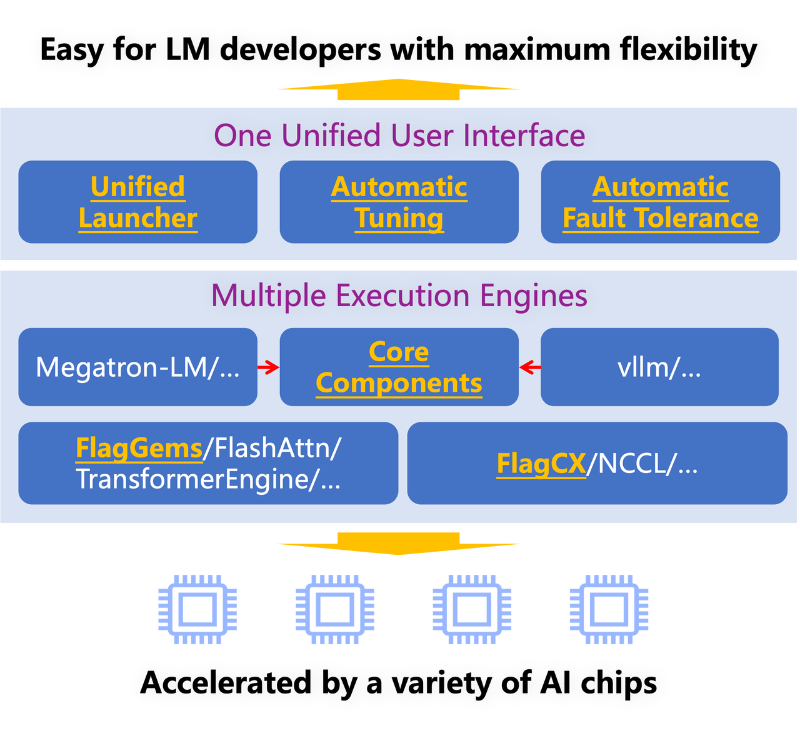

<!-- ABOUT THE PROJECT -->
## About FlagScale

The OpenSeek project uses [FlagScale](https://github.com/FlagOpen/FlagScale.git) as the distributed training framework. This framework is an end-to-end framework for large models across multiple chips, built entirely on open source technology by the Beijing Academy of Artificial Intelligence (BAAI) in collaboration with ecosystem partners, maximizing computational resource efficiency while ensuring model effectiveness.

<div align="center">
  
</div>

The FlagScale architecture can be divided into three layers:

1. **Frontend**: Provides a unified user interface and automation tools, such as a unified launcher and auto-tuning, for a good user experience.

2. **Middleware**: Includes multiple high-performance execution engines, both self-developed and open source, covering training, compression, inference, and service stages, enhancing system flexibility and scalability.

3. **Backend**: Contains underlying operator libraries and communication libraries to ensure efficient and reliable performance, especially the Triton-based operator library [FlagGems](https://github.com/FlagOpen/FlagGems) and unified heterogeneous communication library [FlagCX](https://github.com/FlagOpen/FlagCX), enabling computation and communication across different chips.

This project will utilize the FlagScale framework and leverage the power of the open source community to produce the distributed training system technology of DeepSeek V3 & R1, striving to ensure the stability and practical effectiveness of the system in the end-to-end training process. On this basis, we hope to further explore the collaborative optimization of model algorithms and system efficiency, including:
- **Model Structure Improvement**: Further improve MLA, MTP, and MoE, etc. to optimize performance and training efficiency .
- **Computation and Communication Scheduling Optimization**: Develop general computation and communication scheduling technologies suitable for more chips, enhancing cross-hardware platform compatibility and computational efficiency.
- **Low Precision Training Optimization**: Explore more stable training schemes for low precision numerical formats like FP8 and develop corresponding operator optimizations to reduce computational costs and improve training stability.

Through these technological innovations, we hope to promote the efficiency, compatibility, and scalability of distributed training systems, providing stronger support for large-scale AI training.


## Setup

We recommend using the latest release of [NGC's PyTorch container](https://catalog.ngc.nvidia.com/orgs/nvidia/containers/pytorch) for setup.

1. Clone the repository:
    ```sh
    git clone https://github.com/FlagOpen/FlagScale.git
    ```

2. Install the requirements:
    ```sh
    cd FlagScale/install
    ./install-requirements.sh --env train
    ./install-requirements.sh --env inference
    ```
    The above instructions create two conda environments: `flagscale-train` and `flagscale-inference`, which contain the dependency environments for training and inference, respectively.

3. Install the packages with customized extensions:
    ```sh
    cd vllm
    pip install .

    pip install -e ./megatron-energon
    cp -r megatron-energon/src/megatron/energon megatron/megatron
    ```


## Run a task
FlagScale provides a unified runner for various tasks, including training，inference and serve. Simply specify the configuration file to run the task with a single command.

**Start the distributed training job**
```sh
python run.py --config-path=examples/deepseek_v3/conf --config-name=config_deepseek_v3.yaml action=run
```

**Stop the distributed training job**
```sh
python run.py --config-path=examples/deepseek_v3/conf --config-name=config_deepseek_v3.yaml action=stop
```
**YAML Configuration**
FlagScale leverages [Hydra](https://github.com/facebookresearch/hydra) for configuration management, which are organized into two levels: an outer experiment-level YAML file and an inner task-level YAML file.

In the OpenSeek project, we have open-sourced a DeepSeek model with a total parameter count of 16B and an activated parameter count of 2.4B. This model has been thoroughly validated on real-world datasets, and the loss curve will be released shortly.

- Experiment-level YAML. The experiment-level YAML file defines the experiment directory, backend engine, task type, and other related environmental configurations. [config_deepseek_v3.yaml](https://github.com/FlagOpen/FlagScale/blob/deed35ea8bdc7ed322caf91a44f80dd633a63113/examples/deepseek_v3/conf/config_deepseek_v3.yaml)
  ```yaml
  defaults:
  - _self_
  - train: train_deepseek_v3.yaml
    experiment:
    exp_name: DeepSeek-V3-Test
    seed: 42
    save_steps: 10000
    load: None
    exp_dir: /xxx
    ckpt_format: torch
    task:
        type: train
        backend: megatron
        entrypoint: flagscale/train/train_deepseek_v3.py
    runner:
        per_node_task: false
        no_shared_fs: false
        rdzv_backend: static
        hostfile: null
    cmds:
        before_start: "ulimit -n 1048576 && source /root/miniconda3/bin/activate flagscale"
    envs:
        LOGLEVEL: "INFO"
        CUDA_VISIBLE_DEVICES: "0,1,2,3,4,5,6,7"
        CUDA_DEVICE_MAX_CONNECTIONS: 1

    action: run

    hydra:
    run:
        dir: ${experiment.exp_dir}/hydra
  ```
- Task-level YAML. The task-level YAML file specifies the model, dataset, and parameters for specific tasks such as training or inference.
[train_deepseek_v3.yaml](https://github.com/FlagOpen/FlagScale/blob/deed35ea8bdc7ed322caf91a44f80dd633a63113/examples/deepseek_v3/conf/train/train_deepseek_v3.yaml)
  ```yaml
  system:
    tensor_model_parallel_size: 2
    pipeline_model_parallel_size: 2
    expert_model_parallel_size: 2
    context_parallel_size: 1
    sequence_parallel: true
    use_distributed_optimizer: true
  ...
    checkpoint:
        save_interval: ${experiment.save_steps}
        load: ${experiment.load}
        ckpt_format: ${experiment.ckpt_format}
  model:
    num_layers: 24
    hidden_size: 2048
    ffn_hidden_size: 1408
    num_attention_heads: 16
    num_query_groups: 16 # num_key_value_heads
    seq_length: 4096
    max_position_embeddings: 4096
    norm_epsilon: 1e-6
    rotary_base: 10000
    norm_init_weight: 0.5
    swiglu: true
    untie_embeddings_and_output_weights: true

    # mla args ==================
    multi_latent_attention: true
    q_lora_rank: 1536
    kv_lora_rank: 512
    qk_head_dim: 128
    qk_pos_emb_head_dim: 64
    v_head_dim: 128

    # moe args ===================
    moe_shared_expert_intermediate_size: 1408
    num_experts: 64
    moe_router_load_balancing_type: "aux_loss"
    moe_router_score_function: sigmoid
    moe_router_enable_expert_bias: true
    moe_router_bias_update_rate: 0.001
    moe_aux_loss_coeff: 0.02
    moe_layer_freq: "[0]+[1]*23"
    # node limited routing
    moe_router_num_groups: 1
    moe_router_group_topk: 1
    moe_router_topk: 6

    # mtp args ====================
    num_mtp_predictor: 1

    # training
    seed: ${experiment.seed}
    train_iters: 10000
    micro_batch_size: 1
    global_batch_size: 32
    ...

    optimizer:
    weight_decay: 0.1
    adam_beta1: 0.9
    adam_beta2: 0.95
    lr_scheduler:
      lr: 3.0e-3
      min_lr: 3.0e-4
      lr_warmup_samples: 2048000
      lr_decay_style: WSD
      lr_wsd_decay_style: cosine
      lr_wsd_decay_samples: 2048

  data:
    data_path: /path
    split: 1
    no_mmap_bin_files: true
    tokenizer:
        tokenizer_type: QwenTokenizerFS
        tokenizer_path: examples/aquila/qwentokenizer
        vocab_size: 151851
        make_vocab_size_divisible_by: 64
    ```

## CKPT Conversion
### HuggingFace to Megatron
FlagScale supports the conversion of open-source models and checkpoints (CKPT) from HuggingFace to the Megatron format. Once the conversion is completed, the CKPT can be loaded, and distributed training can be initiated using FlagScale.
For instance, the [DeepSeek-V2-Lite](https://huggingface.co/deepseek-ai/DeepSeek-V2-Lite) 16B model, which is openly available on HuggingFace, can be converted into a CKPT format supported by FlagScale. Subsequently, the model can be directly warm-started by configuring the load option in config_deepseek_v3.yaml.
FlagScale supports uneven partitioning of pipeline stages during the checkpoint (CKPT) conversion when using pipeline parallelism
**convert ckpt**
```sh
cd FlagScale/tools
python convert.py \
    --model-type deepseek_v3 \
    --loader transformers \
    --saver mcore \
    --load-dir DeepSeek-V2-Lite \
    --save-dir converted_bf16_model \
    --target-tensor-parallel-size 1 \
    --target-pipeline-parallel-size 2 \
    --target-decoder-first-pipeline-num-layers 13 \
    --target-expert-parallel-size 4 \
    --target-params-dtype bf16 \
    --true-vocab-size 151851
```
**config yaml**
```
defaults:
- _self_
- train: train_deepseek_v3.yaml
  experiment:
  exp_name: DeepSeek-V3-Test
  seed: 42
  save_steps: 10000
  load: converted_bf16_model
  exp_dir: /xxx
  ckpt_format: torch
  task:
      type: train
      backend: megatron
      entrypoint: flagscale/train/train_deepseek_v3.py
  runner:
      per_node_task: false
      no_shared_fs: false
      rdzv_backend: static
      hostfile: null
  ...
```
**start training**
```sh
python run.py --config-path=examples/deepseek_v3/conf --config-name=config_deepseek_v3.yaml action=run
```

### Megatron to HuggingFace
FlagScale also supports the conversion of model checkpoints (CKPT) trained on FlagScale into the HuggingFace format, facilitating model release and evaluation.
**convert ckpt**
```sh
python convert.py \
    --model-type deepseek_v3 \
    --loader mcore \
    --saver transformers \
    --load-dir bf16_model \
    --save-dir converted_huggingface_model \
    --target-tensor-parallel-size 1 \
    --target-pipeline-parallel-size 1 \
    --target-expert-parallel-size 1 \
    --target-params-dtype bf16 \
    --true-vocab-size 151851 \
```

## Contribution
### Roadmap
See the [FlagAI-Open OpenSeek](https://github.com/FlagAI-Open/OpenSeek) for a full list of proposed features .

- [x] Enhance the distributed training documentation
- [x] Conversion ckpt between FlagScale and Huggingface parameters
- [ ] Improve the installation and usage
- [ ] Research and design a solution can be easily implemented in FlagScale
- [ ] Develop tools for detecting slow nodes, faulty nodes, and NCCL errors in large-scale clusters
- [ ] Implement a distributed log consolidation mechanism
- [ ] Improve the monitoring system of distributed training
- [ ] Support for DualPipe pipeline parallelism
- [ ] Performance analysis of the current DeepSeekMoE distributed training implementation
- [ ] Performance analysis of current long sequence handling
- [ ] Integration of the FlagGems Triton operator library and corresponding training accuracy validation
- [ ] Implementation of the FP8 operators required in DeepSeek V3, with support for validation during the training process
- [ ] Support for DeepSeek NAS or Kimi MoBA etc
- [ ] Implementation of a distributed reinforcement learning system to support efficient DeepSeek R1
- [ ] Tools for detecting slow nodes, faulty nodes, and NCCL errors in large-scale clusters
- [ ] Visualization of the communication flows and scheduling relationships in complex large-scale distributed clusters
- [ ] Achieve more efficient pipeline parallelism
- [ ] Improve communication algorithms to achieve more efficient MoE parallelism optimization
- [ ] Collaborate with algorithm teams to achieve more efficient long sequence optimization
- [ ] Implement customized parallel and optimization strategies for specific chips
- [ ] Implement more innovative FP8 training solutions

### Steps
- fork [FlagScale](https://github.com/FlagOpen/FlagScale) to your own github repo
- generate a copy of the FlagScale repo under your account, with a URL like https://github.com/your-own-id/FlagScale
-  clone the forked repo to your local machine and navigate into the local FlagScale
    ```sh
    git clone https://github.com/your-own-id/FlagScale.git
    cd FlagScale
    ```
- add the upstream repo, thus keeping your fork updated with changes from the original FlagScale repo
    ```sh
    git remote add upstream https://github.com/FlagOpen/FlagScale
    ```
- create a new branch and start development
    ```sh
    git checkout -b feature/my-new-feature
    ```
-  commit your changes
    ```sh
    git add .
    git commit -m "Add my new feature"
    ```
-  push your new branch to your gitHub repo
    ```sh
    git push origin feature/my-new-feature
    ```
- create a pull request (PR) for FlagScale
  - open your github repo page (https://github.com/your-own-id/FlagScale)
  - you will see a prompt with a Compare & pull request button for your newly pushed branch
  - click this button to go to the Pull Request page
- wait for review and merge
- ...
